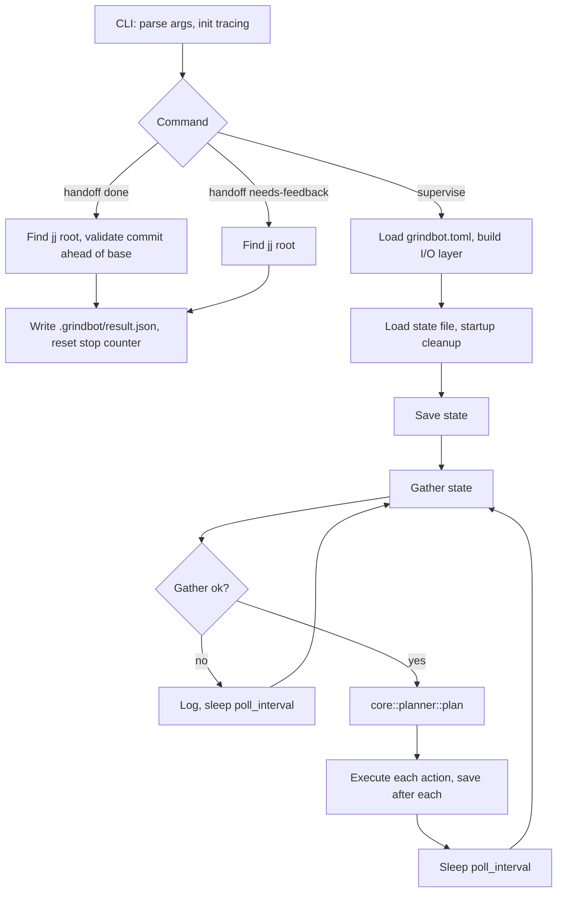

# Supervisor Core Loop

Grindbot is a pure decision core plus an I/O layer. The supervisor loop: gather state → plan → execute → save → sleep → repeat.

## Lifecycle

## Steps

1. **Startup** — `main.rs` parses CLI and inits tracing. `supervise` loads TOML (`config.rs`), builds the I/O layer, loads the state file, runs startup cleanup (reconcile dead/orphaned workspaces), saves. `supervisor.rs:17`
2. **Gather** — `gather_state` fetches open GitHub issues, enriches allowlisted issues with comments, reads `main@origin` head, and builds implementer/workspace state from the state file + live session liveness checks. `supervisor.rs:79`
3. **Plan** — `core::planner::plan` is pure and deterministic. Emits cleanup, completion/feedback, conflict-handling, start, or `Noop`. Planner order: (1) crash cleanup, (2) finished sessions → merge/comment, (3) crashed-with-result cleanup, (4) orphan cleanup, (5) start new implementers up to `max_parallelism`. Eligibility: allowlisted author, last comment not by supervisor, not active, not completed; eligible issues sorted FIFO by creation time. `planner.rs`, `filters.rs`
4. **Execute** — `execute_action` runs the I/O op per action. Errors logged, cycle continues. State saved after each action. `supervisor.rs:293`
5. **Wait** — Sleep `poll_interval_secs` (default 30), repeat. Unbounded loop, no graceful shutdown. `supervisor.rs:54`

## Implementer lifecycle

**Start:** create jj workspace from captured `main@origin` head → write `.grindbot/base_commit`, `.polytoken/hooks.json` (stop gate), `.polytoken/permissions.yaml` (bypass+ with deny rules) → spawn Polytoken session → set facet `plan`, enable adventurous handoff, set permission mode `bypass_plus`, set goal → send issue prompt. `supervisor.rs:419`, `workspace.rs:17`

**Agent session:** the stop hook gates session end. Allows stop when `.grindbot/result.json` exists; otherwise forces `continue`; after 3 consecutive stop attempts with no result, allows stop (classified as crash). `prompt.rs:95`

**Handoff** — `grindbot handoff done --commit <hash>` validates the commit exists and is ahead of base, then writes `result.json` and resets the stop counter. `grindbot handoff needs-feedback --message <text>` writes the result directly. `handoff.rs`

**Completion** — a `done` result triggers rebase onto `main@origin` → bookmark set → push → comment → record completed → reset conflict retries → cleanup workspace. A `needs-feedback` result posts the message, records it, and cleans up. Dead/crashed/malformed sessions are cleaned up via `CleanupWorkspace`. `supervisor.rs:490`, `supervisor.rs:734`

## Conflict handling

A rebase conflict spawns a one-shot Polytoken agent: `execute` facet, 50 max turns, `bypass_plus` permissions, always-stop hook (no gating), 10-minute timeout. It uses the `jj-resolve-conflicts` skill via prompt text. `supervisor.rs:568`

- **Resolved** → retry the merge inline. Success completes the merge; a fresh conflict increments the retry counter and discards the workspace.
- **Unresolved/timeout/dead** → increment retry counter, discard workspace.
- **Escalation (retry count ≥ 3)** → post a persistent-conflict comment (`<!-- grindbot -->` prefix), discard workspace. Because supervisor comments are detected by that prefix and `last_activity_by_supervisor` makes the issue ineligible, the issue is **parked pending human input** — it is not re-queued automatically. `supervisor.rs:580`, `filters.rs:36`

## Module map

| File | Role |
|------|------|
| `src/main.rs` | CLI dispatch |
| `src/config.rs` | TOML config, defaults |
| `src/supervisor.rs` | Loop, gather, execute, startup cleanup, merge/conflict |
| `src/core/planner.rs` | Pure planner |
| `src/core/actions.rs` | Action enum |
| `src/core/state.rs` | State structs |
| `src/core/filters.rs` | Issue eligibility |
| `src/state_file.rs` | Persistent state, conflict retry counters |
| `src/workspace.rs` | Workspace file setup |
| `src/prompt.rs` | Prompt, stop hook, permissions |
| `src/handoff.rs` | Handoff binary |
| `src/io/` | GitHub (`gh`), jj, Polytoken, filesystem I/O |
