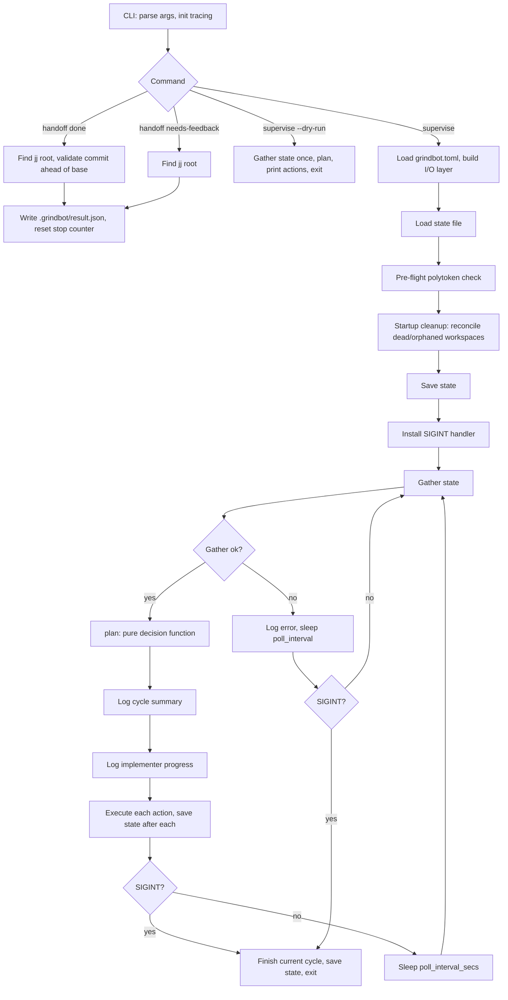
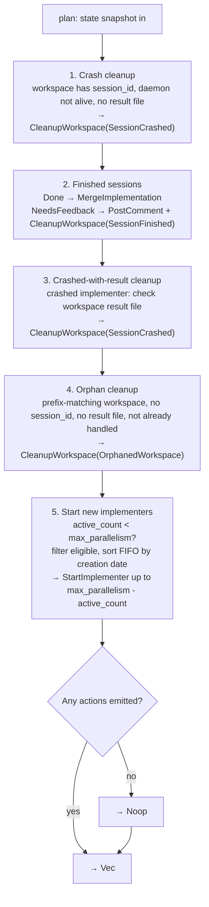

# Supervisor Core Loop

Grindbot is a pure decision core plus an I/O layer. The supervisor loop: gather state → plan → execute → save → sleep → repeat.

## Lifecycle

### Startup

`main.rs` parses the CLI and inits tracing. For `supervise`: load TOML config, build the I/O layer, load the state file. The **dry-run** path gathers state once, plans, prints the planned actions, and exits — no side effects, no startup cleanup, no save. The normal path runs a pre-flight polytoken check, startup cleanup (reconcile dead/orphaned workspaces), saves state, then installs a SIGINT handler for graceful shutdown.

### Gather state

`gather_state` fetches open GitHub issues via `gh`, enriches allowlisted issues with comments, reads `main@origin` head, and builds implementer and workspace state from the state file plus live session checks. For each active implementer, it calls `get_state` (single HTTP round-trip) to determine liveness and extract token usage (`used_tokens`/`limit_tokens`) and the last assistant text snippet. Token growth is tracked across cycles in the state file (`last_used_tokens`, `stall_cycles`); a cycle with no token change increments the stall counter, while growth resets it.

### Main loop

Each cycle: gather state → `plan` → log cycle summary → log per-implementer progress → execute each action (saving state after each) → sleep `poll_interval_secs` (default 30). The progress log shows each running implementer's token usage, stall count, and a snippet of its last assistant message. When `stall_cycles >= stall_threshold_cycles` (default 5), a `warn` is emitted indicating the implementer appears stuck. On SIGINT, the current cycle finishes, state is saved, and the process exits.

## Planner

The planner is a pure, deterministic function: `plan(state) -> Vec<Action>`. It performs **no I/O** and is property-tested in isolation. Decision order matters — earlier phases mark issues/workspaces as handled so later phases skip them.

### Eligibility

An issue is eligible for a new implementer when **all** hold:

- Issue author is on the configured allowlist.
- Last comment is not by the supervisor (supervisor comments carry the `<!-- grindbot -->` prefix).
- Issue is not currently active (not in the active-issues set).
- Issue is not in `completed_issues`.

Eligible issues are sorted FIFO (oldest first) by creation date.

## Implementer lifecycle

**Start:** create a jj workspace from the captured `main@origin` head → write `.grindbot/base_commit`, `.polytoken/hooks.json` (stop gate), `.polytoken/permissions.yaml` (bypass+ with deny rules) → spawn a Polytoken session → set facet `plan`, enable adventurous handoff, set permission mode `bypass_plus`, set goal → send the issue prompt.

**Agent session:** the stop hook gates session end. Stop is allowed when `.grindbot/result.json` exists; otherwise the hook forces `continue`. After 3 consecutive stop attempts with no result file, stop is allowed (the session is classified as a crash).

**Handoff:** `grindbot handoff done --manifest <path>` validates the versioned manifest evidence, commit existence, and commit-ahead-of-base fact, then writes `result.json` and resets the stop counter. `grindbot handoff needs-feedback --message <text>` (or `--message-file <path>`) writes the intentional early-exit result directly. The handoff binary walks up to the nearest `.jj` directory — the workspace root, not the main repo.

**Completion:** a `done` result triggers rebase onto `main@origin` → set bookmark → push → comment → record completed → reset conflict retries → cleanup workspace. A `needs-feedback` result posts the message, records it, and cleans up. Dead/crashed/malformed sessions are cleaned up via `CleanupWorkspace`.

## Conflict handling

A rebase conflict spawns a one-shot Polytoken agent: `execute` facet, 50 max turns, `bypass_plus` permissions, always-stop hook (no gating), **30-minute timeout**. It uses the `jj-resolve-conflicts` skill via prompt text.

- **Resolved** → retry the merge inline. Success completes the merge; a fresh conflict increments the retry counter and discards the workspace.
- **Unresolved / timeout / dead agent** → increment the retry counter, discard workspace.
- **Escalation (retry count ≥ 3)** → post a persistent-conflict comment (`<!-- grindbot -->` prefix), discard workspace. Because supervisor comments are detected by that prefix and `last_activity_by_supervisor` makes the issue ineligible, the issue is **parked pending human input** — it is not re-queued automatically.

## Design decisions

1. **Session completion:** file-based (`result.json`) plus a stop hook that gates session end.
2. **Ticket queue ordering:** FIFO — oldest eligible issue first.
3. **Merge conflict escalation:** discard the newer implementation; after persistent conflicts, park the task for human input.
4. **Permission mode:** `bypass_plus` with deny rules for dangerous commands.
